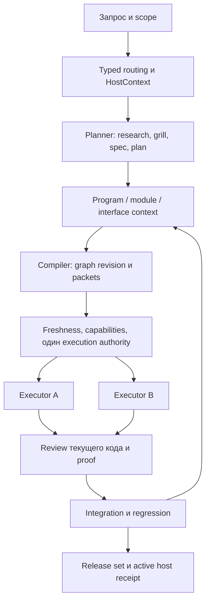

ssheleg skills — make-skill · evidence-docs · task-pipeline · agent-orchestrator · agent-interop · sheleg-design · ux-flows · ux-scenarios

# Финальный аудит и программа изменений ssheleg skills

Срез 2026-09-07. 115 находок (65 P1, 50 P2), 119 связанных task packets: 115 исправлений и 4 enabling задачи. Это не 119 реализованных изменений. Исходные 90 находок сохранены; углубление добавило 10 PF, 7 VD и 8 UP. Пересечения помечены cross-references: количества означают отдельные наблюдения/контракты, а не независимую оценку суммарного риска. [Проверка целостности](packet-validation.json).

Связка «один агент планирует, другие реализуют» архитектурно жизнеспособна. Текущий task-pipeline уже сохраняет Markdown context и graph, но не обеспечивает полноценный dispatch contract. В изолированных проверках два next получают один pending node; старое доказательство закрывает новую revision; close обходит failed certification; parked producer открывает consumer. Fabric также требует исправления follower identity, fan-in и publication fencing. Это препятствия для надёжного внешнего исполнения, а не доказательство потери данных в production. [PF аудит](pipeline-fabric.md).

Слабое визуальное качество объясняется проверяемыми пробелами процесса и возможными причинными механизмами: преждевременный lock закрывает композиционный поиск; comparison инструментов подменяет art direction; screenshots есть, но нет обязательного конкретного critique/change/rerender; platform adapters и общий kit API ограничены. В 39/39 kits Button не пробрасывает произвольные native props и фиксирует type=button, Heading связывает semantic level и размер. Это отдельный технический дефект, не доказанная причина результата Nicegram. [VD аудит](design-depth.md).

В Nicegram design skill действительно читался, был свой dark/gold стиль и интерактивные проверки. Нельзя честно объяснить результат тем, что skill не подключили. A/B chat/services проверял структуру flow, а не два художественных направления. Пользовательская оценка визуала важна, но causal A/B прежних и новых instructions ещё не запускался. Поэтому не обещаем, что один новый абзац гарантирует хороший дизайн. [Трасса Nicegram](nicegram-route-receipt.json). Утверждение об «unstyled shadcn» расходится с поставляемыми default styles в [официальной документации](https://ui.shadcn.com/docs).

Обновления сейчас нельзя считать корректно изолированными: offline fixture --dry-run меняет файлы и запускает 38 mocked subprocess calls; выбранный host не ограничивает всю операцию; prune может удалить единственную plain copy; неатомарная перезапись теряет прежний payload при сбое; super-ux может вернуть exit0 после ошибки вложенной установки. Manifest pins не гарантируют установку тех же immutable bytes. Реальные установки на этой машине не изменялись. [UP аудит и receipts](install-routing.md).

## Целевая архитектура

Планировщик собирает evidence и открытые вопросы, проводит grill только по существенным неизвестным, фиксирует spec и решения на уровне программы/модулей/interfaces. Compiler выпускает версионированный граф и execution packets. Каждый packet содержит не только задачу, но и source base, digest контекста, prerequisites, invariants, concrete steps, acceptance, write set и expected outputs. Связи data/control/resource сохраняются явно.

Перед выдачей работы один authority проверяет closure/freshness/capabilities, материализует prompt в измеренном budget и атомарно выдаёт attempt/fence/lease. Executors работают в изоляции. Reviewer проверяет candidate и proof именно текущей revision; integrator проверяет после merge. Replan порождает новую revision и инвалидирует зависимые evidence. В Fabric authority принадлежит Fabric; standalone mode может иметь другой coordinator, но не два на один run. [Program](context/program.md), [execution contract](context/contracts/execution.md), [context contract](context/contracts/context.md), [решения](context/decisions.json).

UX разворачивается в scenario graph и кликабельный prototype: карта экранов, сценарии, reset, happy/error/recovery/back/cancel, внешние состояния, coverage declared/walked. Draft prototype допустим до production build approval. Визуальное исследование берёт те же реальные состояния, сравнивает направления при сохранении brand invariants, затем консолидирует tokens и повторяет render critique. Все объявленные переходы проверяются; бесконечное множество пользовательских последовательностей не обещается. [Product contract](context/contracts/product.md), [Visual contract](context/contracts/visual.md).

## Что изменено в skills сейчас

В трёх отдельных worktrees подготовлены предметные инструкции: UX recommendation и generated references для clickable flow; task-pipeline execution packets/context closure/typed dependencies; sheleg-design direction exploration и конкретный render critique loop, включая Cursor copy. Production gate уточнён так, чтобы не запрещать предварительный UX prototype. Счётчик repo checks в UX facts обновлён по фактическому результату. Эти правки не реализуют claim/fencing, compiler или Fabric adapter и не закрывают все связанные findings. [Patch manifest](patches/manifest.json).

Проверки узких изменений: super-ux 4629 checks, sheleg-design 5641 checks, task-pipeline validator exit0. Существующие disclosures/unlooked в логах сохранены; успешная структура не называется доказанным product outcome. [UX log](ux-validation.log), [design log](design-validation.log), [pipeline log](pipeline-validation.log). Полный долгий pipeline suite уже выполнялся в исходном аудите; для текущих doctrine edits повторён релевантный validator.

## Проверка жизнеспособности и пределы

Local SQLite handoff simulation прошла 16 проверок: два холодных процесса — один победитель; lease takeover повышает fence; late/stale result отвергается; duplicate completion идемпотентен; fan-in ждёт всех; cancellation блокирует публикацию; missing/changed context и source drift отвергаются; конфликт writes сериализуется; control dependency сохраняется; cycle отвергается. Это исполняемая модель предлагаемого контракта, не production Fabric и не две реальные LLM-сессии. [Результат](handoff-simulation.json), [код](handoff_simulation.py).

119 packets проверены на обязательные поля, локальное замыкание hash refs, source freshness, известные typed dependencies, отсутствие циклов, наследование модели и conservative resource scheduling. 24 расчётных волн не являются сроками. Неизвестные будущие upstream outputs обозначены как expected inputs: до dispatch compiler должен присоединить их и выпустить новую revision. Абсолютные пути этого артефакта пока локальны; перенос bundle в другую машину входит в CTX-02. Prompt tokens ещё не материализованы/не измерены — pre-dispatch gate обязателен. [Validator](packet_contract.py), [manifest](manifest.json).

В Fabric за время аудита появились дополнительные untracked product-report файлы; HEAD и все проверенные tracked source digests остались прежними. Этот run не записывал файлы Fabric. Статус всего рабочего каталога поэтому не объявляется неизменным. [Финальная проверка артефактов](final-validation.json).

Реальные Claude Code ↔ Codex/Fabric handoff, host session reload, distributed authority, npm install/upgrade/rollback и blind visual outcome A/B НЕ выполнялись. Native skill eval предыдущего аудита недоступен из-за early-access gate. Ни один из этих пробелов не превращён в PASS. 14 строк host matrix описывают adapters, а не 14 успешно сертифицированных сред. [Host matrix](install-routing.json).

## Последовательность до завершения

1. Исправить destructive dry-run/prune/atomic update и критические money/auth/claim defects в независимых ветках; fixes не ждут глобального переписывания архитектуры. Зафиксировать CTX-01 и выбранный support matrix до зависимой реализации.
2. Принять и выпустить подготовленные UX/design/pipeline recommendations после review, закрыть оставшиеся build-gate и visual contract противоречия. Внедрить CTX-02 compiler и реальные outcome cases CTX-03.
3. Реализовать PF-01…05: authority, revision-bound proof, certification boundary, required prerequisites, portable packet. Затем PF-06…10: Fabric adapter, follower/fan-in/ownership и Codex tools.
4. Завершить host-aware routing/provider inventory и release-set transaction. Исправить factual/evidence/eval/kit defects по их packet acceptance; независимые задачи могут идти параллельно с пунктом 3.
5. CTX-04 выполняет real cross-host handoff, bounded corpus всех 28 skills, actual render assessment, installation/upgrade/rollback и согласованный release. «100%» наступает только при закрытии всех task acceptance и обязательных support-tier checks, не по числу написанных инструкций.

Старые milestone dependencies заменены task-level edges: глобальная фаза больше не заставляет визуальные/context задачи ждать всех несвязанных исправлений. У каждого packet есть parent module, contracts, решения, конкретное fix direction, source snapshot, acceptance, outputs, rollback и ожидания prerequisites. Приоритет — инженерное суждение по риску и текущему запросу, не псевдоточный score. Статус всех полных задач остаётся planned; локальные doctrine receipts указаны отдельно.

## Артефакты

- [119 task packets, JSON](backlog-final.json) и [CSV](backlog-final.csv).
- [115 findings с исходными evidence](findings-final.json).
- [Первоначальный подробный аудит 28 skills](../report.html).
- [Проверка планов](packet-validation.json), [patches](patches/manifest.json).

## Все задачи

| ID | Приоритет / очередь | Волна | Модуль | Работа |
|---|---|---|---|---|
| [FIX-DV-01](packets/FIX-DV-01.md) | P1 / 0 | 1 | sheleg-dev | Claim фиксирует получение, но ошибочно считается завершением работы |
| [FIX-SY-01](packets/FIX-SY-01.md) | P1 / 0 | 1 | agent-sync | Выданные IDs меняются задним числом; два reserve возвращают один номер |
| [FIX-TG-01](packets/FIX-TG-01.md) | P1 / 0 | 1 | telegram-dev | Crash fixture зелёный, но после реальной redelivery update теряется |
| [FIX-UP-02](packets/FIX-UP-02.md) | P1 / 0 | 1 | sshlg-skills | Принятый --dry-run всё равно запускает обновления и удаляет файлы |
| [CTX-01](packets/CTX-01.md) | P1 / 1 | 1 | task-pipeline | Общий versioned context/task/result contract семьи |
| [CTX-03](packets/CTX-03.md) | P1 / 1 | 1 | super-ux | Интерактивные UX flow previews как связанный deliverable |
| [FIX-AS-01](packets/FIX-AS-01.md) | P1 / 1 | 1 | agent-stack | Сага названа two-phase commit; неопределённый HTTP-исход предписано компенсировать как отказ |
| [FIX-DS-01](packets/FIX-DS-01.md) | P1 / 1 | 1 | sheleg-design | Сравнение packs сменой CSS не имеет общего token API |
| [FIX-MS-01](packets/FIX-MS-01.md) | P1 / 1 | 1 | make-skill | Приближение chars/3.9 выдаёт PASS токенового лимита |
| [FIX-SE-01](packets/FIX-SE-01.md) | P1 / 1 | 1 | seo-aeo-audit | Рекомендации Discover превращены в обязательный gate |
| [FIX-DV-02](packets/FIX-DV-02.md) | P1 / 0 | 2 | sheleg-dev | Пример renewal противоречит тесту переупорядоченных периодов и не сериализует grant |
| [FIX-SY-02](packets/FIX-SY-02.md) | P1 / 0 | 2 | agent-sync | Общий last-renew позволяет активности одного агента подавлять продление чужих leases |
| [FIX-TG-03](packets/FIX-TG-03.md) | P1 / 0 | 2 | telegram-dev | HMAC verifier удаляет поле signature и воспроизводит эту ошибку в собственном oracle |
| [CTX-02](packets/CTX-02.md) | P1 / 1 | 2 | task-pipeline | Report → prioritized packet compiler и context freshness gate |
| [FIX-AS-02](packets/FIX-AS-02.md) | P1 / 1 | 2 | agent-stack | Нулевой baseline путается с отсутствующим: первый реальный расход теряется |
| [FIX-MS-02](packets/FIX-MS-02.md) | P1 / 1 | 2 | make-skill | Самодельный YAML parser теряет типы metadata |
| [FIX-RT-01](packets/FIX-RT-01.md) | P1 / 1 | 2 | sshlg-skills | Лексический роутер теряет намерение и смешивает аудит с изменением |
| [FIX-SE-02](packets/FIX-SE-02.md) | P1 / 1 | 2 | seo-aeo-audit | Любая manual action объявлена обнулением всех улучшений сайта |
| [FIX-UX-01](packets/FIX-UX-01.md) | P1 / 1 | 2 | super-ux | B030 не доказывает происхождение утверждения |
| [FIX-VD-02](packets/FIX-VD-02.md) | P1 / 1 | 2 | sheleg-design | Скриншоты и quality gates есть, но нет обязательного цикла художественной критики конкретного рендера |
| [FIX-DV-03](packets/FIX-DV-03.md) | P1 / 0 | 3 | sheleg-dev | Компенсация количества не компенсирует уже снятые деньги |
| [FIX-SY-03](packets/FIX-SY-03.md) | P1 / 0 | 3 | agent-sync | Local renew перезаписывает уже завершённый steal |
| [FIX-AS-03](packets/FIX-AS-03.md) | P1 / 1 | 3 | agent-stack | Лексическое сходство усиливает противоречащую память и может вернуть старую инструкцию |
| [FIX-EV-01](packets/FIX-EV-01.md) | P1 / 1 | 3 | task-pipeline | Проверка выбора названия не доказывает пользу выполнения скилла |
| [FIX-RT-02](packets/FIX-RT-02.md) | P1 / 1 | 3 | sshlg-skills | Отказ от одного маршрута выключает всю эскалацию; цитата тоже считается отказом |
| [FIX-UX-02](packets/FIX-UX-02.md) | P1 / 1 | 3 | super-ux | B051 объявляет спамом текст без единого повторения |
| [FIX-VD-04](packets/FIX-VD-04.md) | P2 / 1 | 3 | sheleg-design | shadcn назван unstyled: token mapping ошибочно подаётся как достаточное отсутствие чужой визуальной системы |
| [FIX-TG-02](packets/FIX-TG-02.md) | P2 / 2 | 3 | telegram-dev | Оmitted allowed_updates ошибочно приравнен к пустому списку |
| [FIX-DV-04](packets/FIX-DV-04.md) | P1 / 0 | 4 | sheleg-dev | Refund CAS проигрыш молча теряет больший cumulative refund |
| [FIX-SY-04](packets/FIX-SY-04.md) | P1 / 0 | 4 | agent-sync | Task lease не защищает общий файл от владельца другой task lease |
| [FIX-MS-03](packets/FIX-MS-03.md) | P1 / 1 | 4 | make-skill | Аудит по описанию автоматически превращается в исправление и release |
| [FIX-PA-01](packets/FIX-PA-01.md) | P1 / 1 | 4 | task-pipeline | Документированное решение автоматически оправдывает дефект |
| [FIX-UP-01](packets/FIX-UP-01.md) | P1 / 1 | 4 | sshlg-skills | Обещание закреплённого релиза семьи не обеспечено установкой |
| [FIX-UX-03](packets/FIX-UX-03.md) | P1 / 1 | 4 | super-ux | Humanization «никогда не блокирует» расходится с исполняемым B060 |
| [FIX-VD-05](packets/FIX-VD-05.md) | P1 / 1 | 4 | sheleg-design | Общий kit spine фиксирует внешний API ценой базовой DOM-семантики и доступных адаптаций |
| [FIX-SE-03](packets/FIX-SE-03.md) | P2 / 2 | 4 | seo-aeo-audit | Cross-track проверка объявляет совместимые наблюдения противоречием |
| [FIX-TG-04](packets/FIX-TG-04.md) | P2 / 2 | 4 | telegram-dev | Матрица launch surfaces неверно запрещает menu-button query flow |
| [FIX-DV-05](packets/FIX-DV-05.md) | P1 / 0 | 5 | sheleg-dev | Основной idempotency snippet кредитует не только PAID и блокирует жизненный цикл после PAID |
| [FIX-SY-05](packets/FIX-SY-05.md) | P1 / 0 | 5 | agent-sync | Пустой lock между O_EXCL и payload принимается за просроченный: два acquire выигрывают |
| [FIX-UP-05](packets/FIX-UP-05.md) | P1 / 0 | 5 | task-pipeline | Перезапись member/runtime не атомарна и не даёт rollback |
| [FIX-AS-04](packets/FIX-AS-04.md) | P1 / 1 | 5 | agent-stack | Fake-edge test удаляет зависимости по управлению и состоянию, если нет явного payload |
| [FIX-UX-05](packets/FIX-UX-05.md) | P1 / 1 | 5 | super-ux | Поведенческий eval выдаёт PASS проваленному процессу и не проверяет заявленный контракт |
| [FIX-MS-04](packets/FIX-MS-04.md) | P2 / 2 | 5 | make-skill | Платформенные ограничения описаны как универсальные и частично устарели |
| [FIX-SE-04](packets/FIX-SE-04.md) | P2 / 2 | 5 | seo-aeo-audit | Тип источника автоматически подменяет силу конкретного утверждения |
| [FIX-TG-05](packets/FIX-TG-05.md) | P2 / 2 | 5 | telegram-dev | Лимит одного FloodWait не ограничивает бесконечную retry sequence |
| [FIX-DV-07](packets/FIX-DV-07.md) | P1 / 0 | 6 | sheleg-dev | OAuth examples отправляют серверный client_secret и refresh_token в клиентскую cookie |
| [FIX-AS-06](packets/FIX-AS-06.md) | P1 / 1 | 6 | agent-stack | Первый релиз фактически остаётся без исполняемого eval-корпуса |
| [FIX-PA-02](packets/FIX-PA-02.md) | P1 / 1 | 6 | task-pipeline | Отсутствие production измерения запрещает считать доказанный механизм дефектом |
| [FIX-UX-10](packets/FIX-UX-10.md) | P1 / 1 | 6 | super-ux | Loading из существующей задержки превращён в инсценировку вычисления |
| [FIX-VD-03](packets/FIX-VD-03.md) | P1 / 1 | 6 | sheleg-design | Mobile/native ветка не завершена платформенным адаптером, а общий product default остаётся вебовым |
| [FIX-SY-07](packets/FIX-SY-07.md) | P2 / 2 | 6 | agent-sync | Guard охватывает редактор и некоторые git commit, но не все записи через shell |
| [FIX-DV-08](packets/FIX-DV-08.md) | P1 / 0 | 7 | sheleg-dev | ADC precedence написан в обратном порядке |
| [FIX-AS-07](packets/FIX-AS-07.md) | P1 / 1 | 7 | agent-stack | Запрет проверки порядка пропускает подтверждение после действия |
| [FIX-PF-01](packets/FIX-PF-01.md) | P1 / 1 | 7 | task-pipeline | Graph mutation lock не является claim узла или fencing исполнителя |
| [FIX-UX-11](packets/FIX-UX-11.md) | P1 / 1 | 7 | super-ux | Figma fallback и provisional flow не доходят до разрешённого build state |
| [FIX-VD-07](packets/FIX-VD-07.md) | P2 / 1 | 7 | sheleg-design | Каталог внешнего frontend-design приписывает найденному skill запреты, которых его текущий файл не содержит |
| [FIX-DV-09](packets/FIX-DV-09.md) | P1 / 0 | 8 | sheleg-dev | Express OAuth использует общий mutable client и неполную проверку state |
| [FIX-AS-09](packets/FIX-AS-09.md) | P1 / 1 | 8 | agent-stack | OpenTelemetry: закрытый enum и неверное сложение вложенных token counters |
| [FIX-PF-02](packets/FIX-PF-02.md) | P1 / 1 | 8 | task-pipeline | Старое доказательство принимается после смены кода и контракта узла |
| [FIX-UX-12](packets/FIX-UX-12.md) | P1 / 1 | 8 | super-ux | Статический PASS может повысить сценарий до implemented без проверки наблюдаемого результата |
| [FIX-DS-02](packets/FIX-DS-02.md) | P2 / 2 | 8 | sheleg-design | Опрос о значении craft превращён в нормативный порядок разработки |
| [FIX-RT-04](packets/FIX-RT-04.md) | P2 / 2 | 8 | sshlg-skills | Route gate принимает наличие pipeline run за доказательство любого пройденного маршрута |
| [FIX-DV-10](packets/FIX-DV-10.md) | P1 / 0 | 9 | sheleg-dev | Nonce равен присланному клиентом значению, а не ожидаемому сервером |
| [FIX-AS-11](packets/FIX-AS-11.md) | P1 / 1 | 9 | agent-stack | confirm:true и отсутствие одного элемента trifecta не являются доказательством безопасности |
| [FIX-PF-03](packets/FIX-PF-03.md) | P1 / 1 | 9 | task-pipeline | Прямой close обходит проваленную обязательную certification |
| [FIX-UX-15](packets/FIX-UX-15.md) | P1 / 1 | 9 | super-ux | BP-213/214 смешивают обязательное информирование с универсальным согласием на обработку |
| [FIX-DS-03](packets/FIX-DS-03.md) | P2 / 2 | 9 | sheleg-design | Производительность CSS/API описана абсолютами вместо проверяемых условий |
| [FIX-UB-01](packets/FIX-UB-01.md) | P2 / 2 | 9 | sshlg-skills | Аудитор bundle выдаёт расчёт стоимости каталога за фактический расход каждого сеанса |
| [FIX-DV-11](packets/FIX-DV-11.md) | P1 / 0 | 10 | sheleg-dev | Auto-link по email игнорирует случаи, где Google не подтверждает текущее владение адресом |
| [FIX-PF-04](packets/FIX-PF-04.md) | P1 / 1 | 10 | task-pipeline | Parked обязательного producer делает его consumer runnable без payload |
| [FIX-VD-01](packets/FIX-VD-01.md) | P1 / 1 | 10 | sheleg-design | Идентичность фиксируется раньше визуального исследования, а наличие системы закрывает допустимый поиск композиции |
| [FIX-AS-05](packets/FIX-AS-05.md) | P2 / 2 | 10 | agent-stack | Аудируемость ошибочно приравнена к статическому графу |
| [FIX-UP-03](packets/FIX-UP-03.md) | P2 / 2 | 10 | sshlg-skills | Выбор агента не ограничивает весь update |
| [FIX-DV-12](packets/FIX-DV-12.md) | P1 / 0 | 11 | sheleg-dev | Copy-paste FastAPI skeleton не исполняет заявленный CSRF contract |
| [FIX-PF-05](packets/FIX-PF-05.md) | P2 / 1 | 11 | task-pipeline | Saved Markdown brief уже есть, portable immutable node packet ещё нет |
| [FIX-VD-06](packets/FIX-VD-06.md) | P2 / 1 | 11 | sheleg-design | Dials дают числовой ритуал без воспроизводимой визуальной калибровки двух осей |
| [FIX-AS-08](packets/FIX-AS-08.md) | P2 / 2 | 11 | agent-stack | Статистические правила выдают предположения за универсальные границы |
| [FIX-UP-06](packets/FIX-UP-06.md) | P2 / 2 | 11 | super-ux | Super-ux возвращает успешный exit code после неудачной установки |
| [FIX-DV-14](packets/FIX-DV-14.md) | P1 / 0 | 12 | sheleg-dev | Безусловный noscript pixel противоречит consent-gated архитектуре |
| [FIX-PF-06](packets/FIX-PF-06.md) | P2 / 1 | 12 | task-pipeline | Fabric pipeline/skill provisioning из ADR не является существующим task-pipeline integration |
| [FIX-AS-10](packets/FIX-AS-10.md) | P2 / 2 | 12 | agent-stack | Повтор проверки старого ответа назван проверкой изменения решения модели |
| [FIX-DS-04](packets/FIX-DS-04.md) | P2 / 2 | 12 | sheleg-design | Duration table допускает 500ms, общий UI gate запрещает >300ms |
| [FIX-UX-04](packets/FIX-UX-04.md) | P2 / 2 | 12 | super-ux | У одного скилла два несовместимых правила владения strings.md |
| [FIX-DV-15](packets/FIX-DV-15.md) | P1 / 0 | 13 | sheleg-dev | Эталонный string scrubber пропускает распространённый Redis password и bot-token URLs |
| [FIX-PF-07](packets/FIX-PF-07.md) | P1 / 1 | 13 | task-pipeline | Fabric chainAdvance повторно запускает follower, создавая новые задачи |
| [FIX-AS-12](packets/FIX-AS-12.md) | P2 / 2 | 13 | agent-stack | MCP shipping example не закрепляет SDK и использует прежний FastMCP constructor |
| [FIX-DS-05](packets/FIX-DS-05.md) | P2 / 2 | 13 | sheleg-design | No-JS критерий применяется ко всем поверхностям, включая внутренние UI |
| [FIX-UX-06](packets/FIX-UX-06.md) | P2 / 2 | 13 | super-ux | Новый проект Codex получает правило в CLAUDE.md |
| [FIX-PF-08](packets/FIX-PF-08.md) | P1 / 1 | 14 | task-pipeline | Fabric fan-in проверяет каждое ребро отдельно, поэтому запускает неполный consumer |
| [FIX-AS-13](packets/FIX-AS-13.md) | P2 / 2 | 14 | agent-stack | Признак long-running task ошибочно маршрутизирует в A2A вопреки MCP Tasks |
| [FIX-DS-06](packets/FIX-DS-06.md) | P2 / 2 | 14 | sheleg-design | Eval-регрессия не покрывает текущий composition/runtime |
| [FIX-DV-06](packets/FIX-DV-06.md) | P2 / 2 | 14 | sheleg-dev | Универсальный amount waterfall смешивает единицы и взаимоисключающие правила буфера |
| [FIX-PF-09](packets/FIX-PF-09.md) | P1 / 1 | 15 | task-pipeline | Fabric task lease не ограничивает публикацию handoff текущим owner/attempt |
| [FIX-AS-14](packets/FIX-AS-14.md) | P2 / 2 | 15 | agent-stack | Отсутствие evals ошибочно делает весь аудит unfalsifiable |
| [FIX-DV-13](packets/FIX-DV-13.md) | P2 / 2 | 15 | sheleg-dev | Consent guide смешивает политику Google, юридические решения и неподтверждённые проценты |
| [FIX-UP-07](packets/FIX-UP-07.md) | P2 / 2 | 15 | sshlg-skills | Updater не управляет native Codex plugin provider и не проверяет active digest |
| [FIX-UX-07](packets/FIX-UX-07.md) | P2 / 2 | 15 | super-ux | Язык vision и обязательный формат заголовков не согласованы на входе |
| [FIX-UP-04](packets/FIX-UP-04.md) | P1 / 0 | 16 | sshlg-skills | Prune удаляет единственную plain-копию по непроверенной записи registry |
| [FIX-PF-10](packets/FIX-PF-10.md) | P2 / 1 | 16 | task-pipeline | Provider-independent packet возможен, но Codex в текущем Fabric не подключён к его tools |
| [FIX-DV-16](packets/FIX-DV-16.md) | P2 / 2 | 16 | sheleg-dev | Правила восстановления дают противоположные действия для отозванной сессии |
| [FIX-SY-06](packets/FIX-SY-06.md) | P2 / 2 | 16 | agent-sync | Одно gated смешивает lease guarantee, видимость и наличие host enforcement |
| [FIX-UX-08](packets/FIX-UX-08.md) | P2 / 2 | 16 | super-ux | Approval оператора может стереть происхождение предположения |
| [FIX-TP-01](packets/FIX-TP-01.md) | P1 / 1 | 17 | task-pipeline | Обязательное интервью и подтверждение модели предшествуют даже полностью определённой работе |
| [FIX-DV-17](packets/FIX-DV-17.md) | P2 / 2 | 17 | sheleg-dev | FCP ошибочно объявлен неизмеримым в поле |
| [FIX-RT-03](packets/FIX-RT-03.md) | P2 / 2 | 17 | sshlg-skills | Toolkit объявляет доступность машины по инвентарю только Claude Code |
| [FIX-SY-08](packets/FIX-SY-08.md) | P2 / 2 | 17 | agent-sync | Поиск task-pipeline не учитывает native Codex plugin cache |
| [FIX-UX-09](packets/FIX-UX-09.md) | P2 / 2 | 17 | super-ux | Воронки конкурентов из proxy превращаются в «proven base» |
| [FIX-TP-02](packets/FIX-TP-02.md) | P1 / 1 | 18 | task-pipeline | Заявленная независимость от companions противоречит обязательному super-ux и оценке «undesigned» |
| [FIX-DV-18](packets/FIX-DV-18.md) | P2 / 2 | 18 | sheleg-dev | Оптимизационные эвристики превращены в запреты без измерений и поддерживаемых сценариев |
| [FIX-UX-13](packets/FIX-UX-13.md) | P2 / 2 | 18 | super-ux | Общий precondition требует scenarios даже независимому copy/benchmark scope |
| [FIX-TP-04](packets/FIX-TP-04.md) | P1 / 1 | 19 | task-pipeline | Неиспользованное правило автоматически считается ненужным |
| [FIX-DV-19](packets/FIX-DV-19.md) | P2 / 2 | 19 | sheleg-dev | Eval измеряет узнавание доктрины и дизайн-ответ, не безопасность исполняемого результата |
| [FIX-UX-14](packets/FIX-UX-14.md) | P2 / 2 | 19 | super-ux | BP-212 ошибочно объявляет локальное тестирование оплаты невозможным |
| [FIX-DV-20](packets/FIX-DV-20.md) | P2 / 2 | 20 | sheleg-dev | Ошибка окружения классифицируется как доказанный пропуск валидатора |
| [FIX-ED-01](packets/FIX-ED-01.md) | P2 / 2 | 20 | task-pipeline | Переносимость зависит от совместной упаковки соседнего task-pipeline |
| [FIX-PA-03](packets/FIX-PA-03.md) | P2 / 2 | 21 | task-pipeline | Опциональная HTML-страница обязательна в критерии выхода |
| [FIX-TP-03](packets/FIX-TP-03.md) | P2 / 2 | 22 | task-pipeline | Расширяемая schema спорит с обязательными стандартными стадиями и глобальными правилами |
| [FIX-UP-08](packets/FIX-UP-08.md) | P2 / 2 | 23 | sshlg-skills | Host roots фиксированы и расходятся с поддерживаемыми overrides |
| [CTX-04](packets/CTX-04.md) | P1 / 3 | 24 | sshlg-skills | Итоговая outcome certification, поддержка hosts и staged release |

## Предметные дополнения и полный исходный аудит

Полные карточки новых находок с evidence, механизмом, ограничениями и приёмкой: [pipeline/Fabric](pipeline-fabric.md), [visual](design-depth.md), [install/routing](install-routing.md). Каждая из исходных 90 карточек сохранена в [исходном отчёте](../report.md), а её новое место в task graph — в таблице выше.

## Фактически использованные skills

make-skill — конструкция и conformance; evidence-docs — locators/receipts и пределы выводов; task-pipeline — план и handoff doctrine; agent-orchestrator/agent-interop — execution и host seams; sheleg-design — визуальная диагностика и процесс; ux-flows/ux-scenarios — интерактивный flow и покрытие. Другие skills семейства читались как предмет аудита, а не как исполняемые полномочия.

**Made with [ssheleg skills](https://github.com/ssheleg/sshlg-skills)**

- [`make-skill`](https://github.com/ssheleg/make-skill) — аудит конструкции и проверки пакетов
- [`evidence-docs`](https://github.com/ssheleg/task-pipeline) — доказательства и границы выводов
- [`task-pipeline`](https://github.com/ssheleg/task-pipeline) — план и передача контекста
- [`agent-orchestrator`](https://github.com/ssheleg/agent-stack) — контракты исполнения
- [`agent-interop`](https://github.com/ssheleg/agent-stack) — границы host adapters
- [`sheleg-design`](https://github.com/ssheleg/sheleg-design-skill) — диагностика визуального процесса
- [`ux-flows`](https://github.com/ssheleg/super-ux) — кликабельные flow
- [`ux-scenarios`](https://github.com/ssheleg/super-ux) — сценарии и покрытие

A star on [the bundle](https://github.com/ssheleg/sshlg-skills) helps.
