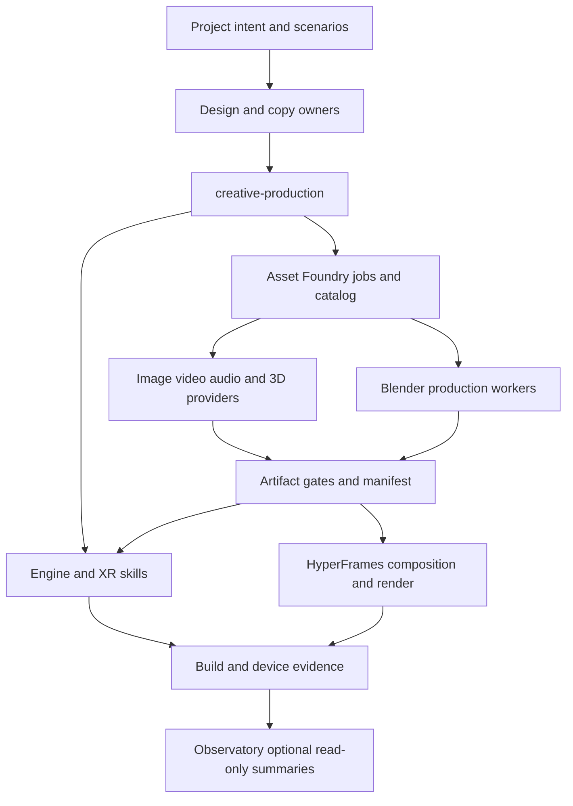

# Proposed skills and Asset Foundry integration

Status: proposed design, 2026-09-21. This extends the [existing harness contract](../../../harness/README.md), rather than renaming packages or replacing the host agent. The [task packets](PACKETS.md) define implementation and acceptance.

## Ownership

The arrows are proposed handoff contracts. They do not claim that Observatory already consumes Foundry events or that every provider is installed.

## Skill catalog proposal

| Skill | Owning package/repository proposal | One job | Does not own |
|---|---|---|---|
| `godot-development` | new `game-dev` pack | Build/audit ordinary Godot projects and their asset/export/test path | Quest distribution and general planning |
| `godot-xr` | `game-dev` | Godot-specific XR setup, interactions and verification | Platform VRC rules already in xr-dev |
| `unity-3d-vr-games` | `game-dev` | Unity project/scene/build/test contract, with Meta specialist delegation | A duplicate Meta SDK encyclopedia |
| `unreal-development` | `game-dev` | Unreal C++/Blueprint/editor/cook/test workflow, Quest reference on demand | Assuming desktop rendering fits a headset |
| `creative-production` | new `creative-dev` pack | Classify requested artifacts and choose a production recipe | Brand, product scenarios, visual direction or provider spending |
| `blender-production` | `creative-dev` | Editable 3D authoring, inspection and export/re-import | Selecting a project's visual identity |
| `ai-media-production` | `creative-dev` | Manage image/video/audio source production and quality, through the configured job owner | Reimplementing HyperFrames or duplicating provider API catalogs |
| `realtime-graphics` | `creative-dev`, after an actual web-3D fixture | Implement Three/R3F/Babylon/Pixi graphics with an explicit runtime and animation owner | New page layout, copy, or unrestricted selection of animation libraries |
| `asset-foundry` | the public Foundry distribution, exposed through the family catalog | Discover/search/estimate/order/review/deliver a managed asset | Editing source art by hand or bypassing the ledger |

The four game skills and first three creative skills are the initial publication candidates. `realtime-graphics` is a later candidate: parts overlap with existing design and WebXR skills, so its release needs measured routing evidence. Provider names usually belong in references/adapters, not one new family skill per vendor. Existing Higgsfield and HyperFrames skills remain optional companions.

These are proposed names and owners; no public repository is asserted to exist for `game-dev` or `creative-dev` yet. Measure their nearest installed neighbors before finalizing trigger descriptions.

## Every skill needs two complete modes

**Build mode:** inspect existing state → establish target/version contract → scaffold only missing files → build a minimal vertical slice → test/import/render/device-check as applicable → deliver evidence and one next step.

**Audit mode:** inventory source and target → run available checks → separate measured failures, semantic risks and unavailable verification → produce a prioritized finding with source location, impact, reproduction and bounded fix. Whole-project diagnosis still enters through the existing project-audit owner; engine/creative skills are specialist checks inside it.

Missing MCP uses a documented CLI/API or manual read-only fallback. Missing engine/hardware returns a useful source/build audit with those checks NOT-RUN. Missing paid-provider authorization produces a validated brief/estimate, never a simulated successful delivery. Write these fallbacks in the skill body at the action that needs them.

## Shared contracts before prose

Proposed versioned contracts, to implement and validate in their owners:

| Contract | Required information | Single owner |
|---|---|---|
| `project-target` | engine/version, SDK/runtime/device, renderer, build target, loader/extensions, capabilities and evidence status | game-dev plus an xr-dev platform reference |
| `creative-brief` | artifact kind, intended use, source references/rights, visual/copy spec links, dimensions/duration, variants, approved budget and review criteria | creative-dev |
| `asset-target-profile` | units/axes, formats, geometry/material/texture/skin/animation/collision budgets, audio/video requirements and consumer loader | Asset Foundry |
| `provider-capability` | provider/transport, operation, schema/version, input/output kinds, auth/billing scope, cost-estimate method, limits and health/verification date | Asset Foundry |
| `asset-manifest` | artifact and input hashes, lineage, provider/model/version/options, job IDs, cost state, rights, transformations, review and consumer verification | Asset Foundry |
| `render-evidence` | scene/composition revision, render settings, frames/duration, tool version, QA findings, output hash and playback scope | consuming engine or HyperFrames task |
| `observation-event` | opaque project/job IDs, schema version, outcome, redacted cost/quality summary and source receipt link | Observatory adapter contract |

Contracts remain inside distributable skill directories when needed at runtime; shared copies must be generated or byte-checked, not maintained independently. Avoid publishing schemas with invented compatibility promises before a consumer actually implements them.

## Asset Foundry: retain the foundation, make delivery portable

The operator's existing Foundry has source for a catalog, job/choice lifecycle, budget/ledger/reconciliation, provider adapters, target profiles, image/audio/GLB checks and Blender/FFmpeg post-processing. The current skill already expresses search → estimate → order → choose → delivery. This is a foundation to extend, not a greenfield service to rename.

The detailed source assessment belongs in its private owning repository; [HANDOFF](HANDOFF.md) links the owner receipt after commit. This public design intentionally omits operational project registrations, machine paths, provider account state and private source excerpts.

Required changes before a public edition:

1. **Separate generic source from operations.** Publish only an explicit allowlist, synthetic projects and fixture data. Preserve the private installation and its state. A fresh-history public edition follows the Observatory precedent unless a full-history review proves the existing repository safe to expose.
2. **Prove installation outside the repository.** Registry, pipeline, profile and script resources must be included or initialized explicitly. Store/cache/config locations must be external writable paths, not derived from a checkout or site-packages. A clean-wheel test in this research reproduced a missing default registry; the private owner receipt holds the reproduction. Fix it and test the full free fixture from a clean environment.
3. **Report actual capability.** Distinguish catalog entry, implemented adapter, installed dependency, authenticated provider and successful live probe. A configured provider ID must not be advertised as ready when construction failed.
4. **Add providers incrementally.** Higgsfield and HeyGen adapters use common submit/status/result/cancel/reconcile contracts. CLI can be an initial adapter only with versioned JSON/schema handling and no shell interpolation of prompts. Production HTTP is appropriate when supported.
5. **Keep long jobs durable.** Persist jobs, stage inputs, external identifiers, budget reservations and review decisions. Resume after process/network failure; do not retry an unknown remote submission as a new charge. Optional MCP Tasks support must be negotiated, with plain job-ID polling retained where needed.
6. **Preserve artistic derivation.** Blender edits and HyperFrames renders create child manifests, retaining source/master assets. Do not overwrite a delivered artifact and pretend the old hash/provenance still applies.
7. **Agent-led onboarding.** One documented entry performs discovery, local config initialization, optional provider setup, a free fixture run, then a separately budgeted live probe. Read secrets locally; never solicit values in chat.
8. **Open-source floor.** English README, installation/upgrade/uninstall, examples, CONTRIBUTING, SECURITY/private reporting channel, license notices, CI, protocol/tool documentation and a public limitations list. Do not equate a source repository becoming public with a working install.

## Gateway and host integration

Follow the supplied operator policy:

- New standalone stdio or static-token HTTP servers are declared in the gateway's `servers.yaml`, then generated/migrated using the gateway's existing tools.
- OAuth protected-resource servers remain directly configured in the agent. Higgsfield's probe confirms that class; HeyGen's official documentation describes it, while our probe was inconclusive.
- Plugin-owned MCP registration stays with the plugin; do not add a duplicate gateway/direct entry.
- GUI processes are not launched invisibly from a system service. For Blender and Unreal, keep editor lifecycle under the user's app/session; verify whether a local bridge can be supervised safely before choosing its gateway arrangement.

These paths are deployment decisions, not instructions to edit this machine now. Pin reviewed versions, discover tool names and negotiated protocol features, and record a working read-only handshake before testing writes.

## Harness and Observatory integration

The family launcher should describe Foundry as a **separately installed production service**, parallel to Observatory as a separately installed observation service. Installing the skill family must not silently install Blender, a GPU stack, provider CLIs or paid services.

Proposed family changes after member releases: catalog entry, verified install/update path, skill routing, tool-pack selection, website relationship and source links. Do not move parent submodule pins to unreviewed implementation branches. If Foundry's service repository is a different distribution shape from a skill pack, add an explicit companion-tool manifest rather than pretending it is an npm skill member.

Observatory should initially read redacted job summaries or exported manifests from explicitly enrolled projects. It does not need prompts, input photos, voice samples, signed download URLs or credentials to report failure/cost/quality trends. Detect drift and repeated failures; it must not regenerate assets or increase budgets as a side effect of observation.

## Acceptance is artifact-specific

A useful release must pass packaging/links/negative checks, then behavior tests. Examples: unsupported renderer rejected; duplicate provider retry reconciled; missing MCP yields a useful fallback; a compressed GLB with an unsupported extension is rejected; Blender export survives re-import; translated captions preserve a glossary; a video with a missing last frame fails QA. Run baseline and candidate with the same fixtures and installed neighbors. Record model, source revision and limits; a written checklist is not an executed eval.

## Optional self-hosted inference follow-up

[VLLM-OMNI](VLLM-OMNI.md) evaluates a separate accelerator-backed service as a Foundry provider, with P16 defining acceptance. Foundry remains the durable job/asset/cost owner; Omni's task APIs and model pipelines provide inference. Runtime NPC/camera use is a separate experiment with consent, latency and offline behavior. The family catalog should expose a verified capability/reference before introducing a new mandatory serving skill.
